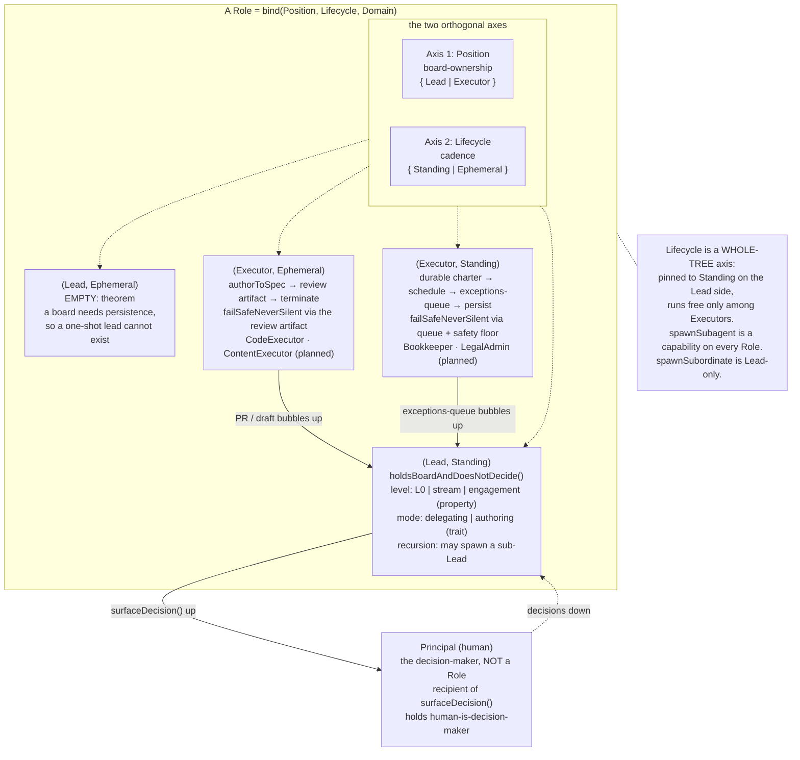

# The agent-role topology

## TL;DR

The agent-role paradigm has a type system, and it is built from two orthogonal axes, not one inheritance chain. *Context as Architecture* showed that an agent's context is positioned by two independent axes (routing level, and load-pattern-plus-content-type). This paper shows the agents themselves are positioned the same way: by **position** (does the role hold a board and delegate, or author a work product) and **lifecycle** (is the role standing, with a durable charter and a schedule, or ephemeral, opening a review artifact and terminating). A concrete role is a binding of three things: a position, a lifecycle, and a domain. The two axes form a 2x2 grid, and one cell of that grid is provably empty: the **Lead x Ephemeral** cell cannot be inhabited, because holding a board requires persistence, so a one-shot lead is a contradiction in terms. Lifecycle is therefore a whole-tree axis that is pinned to Standing on the Lead side and runs free only among Executors. Above the grid sits the **Principal**: the human decision-maker, the typed root every Lead reports up to, and the recipient of every surfaced decision. The Principal is not a Role; it is the authority Roles answer to. The only true classes in the system are the concrete domain bindings: `CodeExecutor` and the planned `ContentExecutor` in the (Executor, Ephemeral) cell, `Bookkeeper` and the planned `LegalAdmin` in the (Executor, Standing) cell. Position, lifecycle, level, and mode are all axes or properties, never subclasses; the bias throughout is to prefer a property or a trait to a subclass unless the interface genuinely varies. This topology is the type system that icm-kit's role layer (SPEC v0.2) instantiates with `init` and validates instances against with `audit`, and the paper is careful about which of those validations a file/tree linter can actually perform statically and which are runtime-semantic obligations it cannot.

## Why a topology

The agent-role convention names two roles and lets the rest follow from scope. That is the right starting altitude for an operating manual a human reads, and the wrong altitude for a tool that has to *check* the structure. A linter cannot validate "one recursive lead plus leaf executors" until it knows precisely what a role *is*: which members every role must have, which distinctions are real axes, which apparent kinds are just an axis set to a different value, and where a shared obligation lives so it is inherited rather than restated. Those are type-system questions. This paper answers them.

The discipline is the one *Context as Architecture* applied to folders. That paper took an informal "put things where they belong" intuition and resolved it into two independent axes with a precise classification function, which is what made the structure machine-checkable. This paper takes the informal "one lead plus leaves" intuition and resolves it into a typed structure for the same reason and the same downstream consumer. Where the first paper classifies *files*, this one classifies *roles*. Both feed icm-kit; the role layer is the file layer's question asked one level up.

The v1 of this paper made one structural mistake worth naming, because the correction is the spine of everything below. It modeled roles as a single inheritance chain rooted in an abstract `Role`, splitting first by position and then, *under* the executor branch, by cadence. That made cadence look like a property of executors only. It is not. Lifecycle cross-cuts the entire tree: a Lead is itself a *standing* role (it holds a continuously available board), so lifecycle is a question you can ask of a Lead too, and the answer is forced. A single inheritance chain cannot express "this axis applies everywhere but is pinned on one side," because inheritance only lets a distinction live at one depth. Two orthogonal axes can. So the v2 re-roots the model on two axes, and the empty cell and the pinning fall out as theorems rather than getting hidden inside a branch where they were never visible.

## The two axes

A role is located by two independent questions. Neither answers the other; both are needed to place a role.

**Axis 1, Position (board-ownership).** Does the role hold a board and delegate, or author a work product? Two values:

- **Lead.** Holds the board for its scope, delegates execution downward, reviews and synthesizes what bubbles up, and surfaces decisions to the Principal framed for a fast call. The defining structural property is **recursion**: a Lead's subordinates can themselves be Leads, scoped narrower, with the same contract repeating all the way down. This is the fractal property of context-as-architecture applied to the org axis rather than the folder tree: same role, different scope.
- **Executor.** Authors a work product to spec and opens it for review. Holds no board, spawns no subordinate, reviews nothing beneath it; it is a terminal node. Its autonomy is bounded execution autonomy.

The position axis is exhaustive and exclusive: a role is one or the other, never both and never neither. The discriminant is **board ownership**. Holds a board implies Lead; authors a product with no board implies Executor. This is the cleanest line in the topology, and the one a checker draws first, because almost every role failure mode is a role behaving as if it were on the other side of it (a lead that authors a product it should have delegated; a leaf that delegates). Authoring is orthogonal to this line: an authoring lead (the thought-partner mode, below) has its hands on the content yet remains a Lead, because it still holds a board. What makes a role an Executor is authoring a product *and* holding no board, not authoring as such.

**Axis 2, Lifecycle (cadence).** Is the role standing or ephemeral? Two values:

- **Standing.** Stood up once against a durable charter, then persists. It wakes on a recurring schedule (cron-like or event-driven), runs a standing SOP against state that survives between runs, and does not terminate after one unit of work; it sleeps until its next wake.
- **Ephemeral.** Invoked with a per-task spec, authors its product, opens it for review, and terminates. A fresh instance per task, no durable charter beyond the spec it was handed, no standing schedule. Its lifecycle is open, build, review, close, done.

Lifecycle is independent of position as a *question*: you can ask either axis of any role. But the two axes are not free of each other in their *answers*, and the constraint that links them is the subject of the next section. The crucial reframing from v1: neither axis is a subclass chain. v1 treated Standing as a subclass of an executor base but treated mode as a trait, applying two different bars to two similar distinctions. Here both position and lifecycle are axes, set per role, and the inconsistent bar is gone.

## The grid, and the empty cell

The two axes give a 2x2 grid. Three cells are inhabited; one is provably empty.

| | **Ephemeral** | **Standing** |
|---|---|---|
| **Lead** | *(empty, by theorem)* | every Lead: L0, stream lead, engagement lead |
| **Executor** | `CodeExecutor`, `ContentExecutor` (planned) | `Bookkeeper`, `LegalAdmin` (planned) |

**The Lead x Ephemeral cell is empty, and it is a theorem, not an accident.** A Lead's defining function is to *hold a board*: a continuously available, durable view of its scope that subordinates write to and the Lead reads from across many wakes. Holding a board requires persistence. An ephemeral role, by definition, opens for one task and terminates, taking its state with it. So a one-shot lead would have to hold a board it cannot persist, which is a contradiction: the moment it terminated, the board it was meant to hold would have no holder, and the subordinates that bubble up to it would have nothing to report to. There is no coherent role in this cell. The emptiness is forced by the meaning of "board," not by a design choice we could revisit.

This is why **lifecycle is a whole-tree axis that is pinned on the Lead side and runs free only among Executors.** Every Lead is necessarily Standing. Lifecycle still *applies* to Leads as a question (it is a tree-wide axis, asked of every node), but on the Lead side the answer is not a choice; it is fixed to Standing by the theorem above. Only on the Executor side does the lifecycle axis actually take two values, because an executor that authors one product and terminates (ephemeral) and an executor that runs a standing SOP on a schedule (standing) are both coherent. This is exactly the shape v1 could not express, and the reason the single inheritance chain was unsound: a chain that splits cadence beneath the executor branch silently asserts cadence is an executor-only concern, when it is really a tree-wide axis that happens to be pinned on one side.

A note on the recursion, expressed now as a property of the Lead position rather than a subclass behavior. A Lead being recursive does not mean a Lead *contains* sub-Leads as a fixed part. It means a Lead *may* spawn a subordinate Lead when its board outgrows one lead, and need not when it does not. The recursion is a capability exercised on demand, not a mandatory composition. An engagement that needs no sub-lead has a Lead with no Lead children, and that is well-formed. This is the "do not pre-build empty levels" rule, expressed as structure: the tree is grown by spawning, not declared by nesting.

**Reconciling with the Bookkeeper charter.** The Bookkeeper charter opens with `Bookkeeper extends LeafExecutor` and calls itself "the standing variant." That OOP shorthand stays valid and is not contradicted here: it is simply the (Executor, Standing) binding written in inheritance notation. "Extends LeafExecutor" names the Executor position; "the standing variant" names the Standing lifecycle. The charter is describing a point on the grid using the vocabulary it had; the grid is the same fact stated on two axes instead of as a subclass. Anyone reading the charter and this paper together should map "the standing variant of LeafExecutor" directly onto the (Executor, Standing) cell and find them identical.

## The Principal: the typed root above the grid

Every Lead surfaces decisions upward. v1 had the method (`surfaceDecision()`) but no typed recipient for it: the human existed in the prose as "the decision-maker" but had no place in the type system, so a checker could not name what a surfaced decision was surfaced *to*. The v2 closes that gap by typing the human as the root.

**Principal.** The Principal is the human decision-maker. It is the typed root of the structure, sitting *above* the grid. Critically, the Principal is **not a Role.** It is the authority that Roles report *to*, not a node that holds a board or authors a product. It does not have the Role interface (no charter-set-from-a-class-body, no file-substrate contract it is reviewed through, no bounded execution autonomy, because its autonomy is exactly the *unbounded decision authority* every Role lacks). Modeling it as a Role would be a category error: the whole structure exists to feed the Principal, so the Principal cannot be one of the things being fed.

What the Principal *is*, in type terms:

- **The recipient of `surfaceDecision()`.** Every Lead's `surfaceDecision()` returns a framed call *to the Principal*. Now the method has a typed target. The decision travels up the Lead chain, getting distilled at each level, until it reaches the Principal as a small set of framed calls.
- **The holder of `human-is-decision-maker`.** v1 correctly made `human-is-decision-maker` a base invariant on every Role: every Role's autonomy is bounded execution autonomy, never decision autonomy. The Principal is the *other side* of that invariant: the one place decision autonomy actually lives. Every Role keeps the decision with the human; the Principal is who "the human" denotes in the type system.
- **The top of every Lead chain.** Every Lead reports up to either a parent Lead or, at the top, the Principal. The L0 lead's parent is the Principal directly. A stream lead's parent is L0, whose parent is the Principal. The chain always terminates at the Principal, never in a cycle and never in another Executor.

So the reporting structure is: Executors bubble up to Leads, Leads bubble up to parent Leads, the top Lead bubbles up to the Principal, and decisions flow back down as direction once the Principal calls them. The Principal is the fixed point that makes the recursion bottom out at the top.

## The shared interface every Role implements

Both positions, both lifecycles, and every concrete class share one interface. A checker can ask any Role instance the same questions because every Role answers the same members. There are six, plus one capability.

**Identity / charter.** Every Role has a durable declaration of what it is and what it is for: its scope, its standing constraints, its mode. For a Lead this is the lead contract plus the scope's `CLAUDE.md`, stacked per the context-architecture loading sequence. For an Executor it is the class charter (e.g. the Bookkeeper charter) plus the client root `CLAUDE.md`, stacked at spawn. The charter is `identity` content in the context-architecture sense: declarative, durable, the answer to "what kind of agent am I in this scope." It is the field that makes a Role a *class* and not a prompt, because it is set per instance from the same class body.

**Context (fields).** Every Role holds per-instance state: the situational facts its work runs against. The class body names the fields; every value is set per instance. This is the class/instance seam, and it is where reuse lives. The `Bookkeeper` class declares `chartOfAccounts`, `jurisdiction`, `accountantFormat` and the rest as *fields*; the Javed instance binds them to Ontario HST, QuickBooks, and a job-costing registry. None of those values live in the class. A Lead's context is its board: the workspace files it reads at its routing level. Same member, different shape; the board is a Lead's situational state exactly as the field-set is an executor's.

**Skills (methods).** Every Role has a set of operations it can perform. For an executor these are concrete and enumerable, like the Bookkeeper's `intakeTransaction()`, `attributeTransaction()`, `flagException()`. For a Lead the skills are coordination operations: hold-the-board, delegate, review-and-synthesize, surface-decision, spawn. Skills are declared on the class and exercised per instance. A skill a Role declares must *resolve*: it must name a capability the instance can actually perform, with any connection it depends on actually wired. An unresolvable skill is a structural error (a role failure mode, below).

**Contracts (the review substrate).** Every Role exposes its work through a defined interface to the rest of the structure, and that interface is a *file/substrate contract*, never a live message. The contract differs by lifecycle, which is what makes lifecycle a real axis and not a cosmetic flag. An **ephemeral** executor's contract is the PR (or a draft for sign-off): the artifact plus its description, comments, and review thread, surfaced whole. A **standing** executor's contract is the exceptions-queue plus the run log plus the periodic package, with only the exceptions surfaced. A Lead's contract is its board (read by its parent Lead, or by the Principal at the top) plus the upward channel (`sync/l1-to-l0.md` for an L1 reaching L0). The contract is how the Role is observed and reviewed; it is the typed boundary between a Role and everything above it.

**Files-not-messages.** Every Role coordinates through the shared substrate, never by in-session conversation with another Role. This is not a behavior a Role *chooses*; it is a structural invariant, because Roles are separate observable instances that cannot talk in-session even if they wanted to. A Lead holds its board by *reading* files; a subordinate bubbles up by *writing* a file the Lead reads. The reporting lines are file read/write relationships. Any Role that tries to route work through the human as a courier, rather than through the substrate, has violated this rule. (The Principal observes the substrate; it is not a relay.)

**Human-is-decision-maker.** Every Role's autonomy is bounded *execution* autonomy, never *decision* autonomy. The entire structure exists to scale the Principal's judgment by feeding it well-synthesized boards and well-framed decisions; it does not delegate the judgment. A Lead that makes a strategic, commercial, relationship, or irreversible call has broken it; so has an Executor that decides an ambiguous tax treatment or creates a new ledger entity. The rule is identical at both positions, which is why it belongs to the shared interface and not to one axis. It is the single most important member, and it is abstract: each concrete class operationalizes *where* its decision boundary sits, but every Role has one and every Role keeps it with the Principal.

**`spawnSubagent` (capability).** Every Role can spawn an ephemeral subagent for its own cognition (research, mapping, review) that returns a synthesis and disappears. This is a capability on every Role, not a class in the topology (the modeling call is below). It sits on the shared interface, available equally to a Lead (to advise well) and to an Executor (to understand the code it is about to change). Only `spawnSubordinate` (spawn a leaf or a sub-lead) is Lead-only, since only a Lead has subordinates.

These members are the shared interface. Position and lifecycle add structure (a board and `spawnSubordinate` on the Lead side; a work product and a lifecycle-shaped review substrate on the Executor side) without removing any of them. A `Bookkeeper` is still answerable to all six; it binds them to an (Executor, Standing) shape.

## The concrete classes

The grid cells are abstract; running agents are instances of concrete classes, each fixing the shared members and the axis bindings to a domain. The Lead cell's "classes" are named *bindings of the level property* (L0, stream lead, engagement lead), not subclasses, because the role model is explicit that they are one role at different scopes. The two Executor cells hold the genuine concrete classes.

**`CodeExecutor` (Executor, Ephemeral).** The development leaf. Spec: a GitHub issue with acceptance criteria. Skills: read the codebase, implement to spec, test, open a PR. Context fields: the repo, the branch flow (`feature/* -> develop -> main`), the conventions (test-first, no Claude trailer, surface-don't-absorb). Contract: the PR (description is what it built, how it verified, what it is surfacing-not-absorbing; comments are ongoing status and flags; the diff is the primary artifact). Lifecycle: terminates on merge. This is the canonical ephemeral executor: the dev instances in `receipt-intake` / `armature` (consulting) and `icm-kit` (OSS) are `CodeExecutor` instances, each bound to its repo.

**`ContentExecutor` (Executor, Ephemeral, planned).** The second inhabitant of the (Executor, Ephemeral) cell, alongside `CodeExecutor`. It drafts a content work product (a document, a client-facing write-up, a memo) for sign-off rather than code for merge. Spec: a brief plus acceptance criteria. Skills: draft to brief, self-check against the brief, surface the draft with its open questions flagged. Context fields: the voice rules, the audience, the structural conventions for the document type. Contract: the **draft file in its workspace** is the review substrate (the content analogue of the PR diff); the leaf writes the draft and its notes there, the lead reviews in place, the Principal gets the decision. Lifecycle: terminates on sign-off. It is promoted here from v1's speculative "open slot" to a named planned class for two reasons. First, it is already first-class in the role convention: the convention names "content a delegating lead should not own" as a thing a leaf executor authors, and defines the non-code review substrate as "the draft file and its workspace location." Second, it is the structural reason the Bookkeeper charter needs a *Contract B* at all: the charter had to define a review substrate "that replaces the PR" precisely because not every executor authors code with a PR, and `ContentExecutor` is the other half of that observation made concrete in its own cell.

**`Bookkeeper` (Executor, Standing).** Keeps a small business's books current and produces the periodic accountant package. Charter: capture, attribute, tax, categorized ledger, accountant package, full stop. Context fields: `chartOfAccounts`, `accountingMethod`, `jurisdiction`/`taxRegime`, `accountantFormat`, `attributionTargets`, `booksLocation`, `intakeChannel`, `confidenceThresholds`, `materialityFloor`, and the rest, every value bound per instance. Skills: `intakeTransaction()`, `extractFields()`, `attributeTransaction()`, `flagException()`, `categorizeTransaction()`, `reconcileAccount()`, `trackTax()`, `closePeriod()`, `generateAccountantPackage()`, `flagAnomaly()`. Contract: the accountant package (Contract A) plus the exceptions-queue + run-log + wake-notification (Contract B, which the charter names explicitly as "replaces the PR"). Lifecycle: persists; wakes on the books schedule. The Javed instance binds the fields to a production-design company in Ontario; the class body holds none of those values. This is the first concrete class shipped on the framework.

**`LegalAdmin` (Executor, Standing, planned).** The next-most-obvious standing class: keeps a small business's legal-administrative state current. Charter (sketch): track obligations and renewals (filings, registrations, insurance, contract expiries), surface what is coming due, assemble the periodic compliance package, escalate anything consequential. Context fields would include the jurisdiction's filing calendar, the entity's registration set, the contract registry, and the renewal-lead-time policy. Skills would parallel the Bookkeeper's shape: intake a document, extract its key dates and parties, attribute it to an obligation, flag exceptions, assemble a package, never file or sign. Contract: an obligations register plus an exceptions-queue plus a periodic compliance package. Lifecycle: persists; wakes on a calendar cadence. Listed as *planned* to show the (Executor, Standing) cell has more than one inhabitant, which is what justifies it being a cell.

**The open room.** Both Executor cells have room the current classes do not fill, and the room is structural, not speculative. The (Executor, Standing) cell takes any durable-charter, schedule-woken, exceptions-queue role (an inbox-triage executor, a renewals/subscriptions executor, a compliance-watch executor). The (Executor, Ephemeral) cell takes any per-task, PR-or-draft, terminate-on-review role beyond the two named (a `MigrationExecutor` that performs a one-shot data migration behind a reviewable artifact, for instance). New concrete classes are added the way new workspaces are added in *Context as Architecture*: instantiate the existing pattern at a new domain. The axis bindings and shared members do not change; only the domain bindings do.

## The modeling calls

A taxonomy can wave at "leads and leaves"; a type system has to commit. Each call below is a place the role model leaves genuine room for interpretation, and the topology picks one precise answer and labels it. The bias throughout is the same one good object modeling uses: **prefer a property or a trait to a subclass unless the candidate genuinely varies the interface**, because every subclass is a permanent commitment a checker and a generator must both carry, whereas a property is cheap to set and a trait is cheap to compose. In the v2 framing this bias is applied uniformly: position and lifecycle are *axes* (set per role), level and mode are *properties/traits*, and nothing in the model is a subclass except the concrete domain bindings.

### Position and lifecycle: axes, not a subclass chain

**Call: two orthogonal axes.** Position and lifecycle each take values that any role can be asked for; a concrete role is a binding of both (plus a domain). Neither is a subclass of the other, and neither is a subclass of a shared `Role` base.

**Why.** The v1 model made position the first subclass split and lifecycle a second split *under* the executor branch. That is unsound for the reason set out above: lifecycle is a tree-wide question (a Lead is a standing role too), and a chain can only place a distinction at one depth. Two axes place the distinction everywhere and then record the constraint (the empty cell, the pinning) separately. This also removes v1's inconsistent bar, where lifecycle was a subclass but mode was a trait, applying two standards to two similar distinctions. Here the rule is uniform: the structural questions (position, lifecycle) are axes; the within-position variations (level, mode) are properties and traits; only the domain bindings are classes.

### The Lead invariant: holds-a-board-and-does-not-decide, not authors-nothing

**Call: the Lead discriminant is board-ownership plus non-decision. It is *not* "authors nothing."**

**Why.** v1 put `authorsNothing()` on Lead as an invariant. That is wrong against the role model's own authoring lead. The convention defines an **authoring lead / thought-partner** mode for coaching and training, where the lead "co-authors the work directly with the human, no leaf," and states plainly that "the one difference is the lead's hands are on the content." An invariant that says a Lead authors nothing makes the authoring lead ill-typed against its own supertype: it would be a Lead that violates the Lead invariant, which is incoherent. The fix is to identify what *actually* discriminates a Lead. It is two things: it **holds a board**, and it **does not decide** (it surfaces decisions to the Principal and makes only routine coordination calls). Both hold for the delegating lead and the authoring lead alike. The authoring lead still holds its board, still surfaces decisions, still keeps every judgment with the Principal; it simply also has its hands on the content. So the corrected invariant is **`holdsBoardAndDoesNotDecide()`**, and authoring vs delegating is a *mode trait* (next call), not a violation of it. The non-decision half is the load-bearing part: it is what makes a Lead a Lead and not a Principal, and it holds in both modes.

### Lead mode (delegating vs authoring): a trait

**Call: trait on Lead.** Mode is a composable aspect, not a position value and not a subclass. A Lead is `Delegating` or `Authoring`; both are the same position with a trait set.

**Why.** Mode does not vary the Lead interface. A delegating lead and an authoring lead both hold a board, both surface decisions to the Principal, both keep judgment with the Principal, both coordinate through files, both satisfy `holdsBoardAndDoesNotDecide()`. Every shared member is identical. The single difference is *where the authoring happens*: a delegating lead spawns an Executor and reviews its product; an authoring lead co-authors the product directly with the human and spawns no execution leaf. That is one behavior toggled with the rest of the interface unchanged, the textbook profile of a trait. The authoring trait *removes* a capability (spawn-execution-leaf) rather than adding one, and it is used "only where the human is the domain expert and holds the relationship," which is a *policy* condition, not a structural one: set per instance based on the situation (coaching and training run authoring; consulting and OSS run delegating). The authoring trait is exactly where the lead's hands are on the content; the non-decision invariant is what holds across both. So: trait, set per instance, default delegating. This is the correction's pay-off: by moving the true invariant to non-decision, the authoring mode stops being an exception and becomes a clean trait value.

### Levels (L0 / L1 / L2): a scope property of Lead, not classes

**Call: a property.** `L0`, stream lead, engagement lead are not distinct classes. They are the single Lead position at different values of a `scope` (or `level`) property.

**Why.** This is the central reuse claim of the role model, and the type system has to honor it. The role model is explicit: a stream lead is "a nested L0, scoped to one stream... Not a new role, the same role at a narrower board," and an engagement lead is the same again, narrower still. If L0, stream lead, and engagement lead were three classes, "same role at a narrower scope" would be false. The fractal property *is* the claim that they are one position parameterized by scope. So level is a property of Lead, taking values along the routing hierarchy (whole-business, stream, engagement), and the concrete names are *named bindings* of that property, the way "the Javed Bookkeeper" is a named binding of `Bookkeeper`. This lines the role axis up with the context axis cleanly: *Context as Architecture* made L0/L1/L2 a property of the vertical routing axis, not three kinds of file, and the role layer mirrors that exactly. One routing hierarchy, read once for files and once for roles, same answer shape. The top of the level property (L0) is the Lead whose parent is the Principal directly.

### Ephemeral subagents: a capability, not a class

**Call: a capability (method), not a node in the topology.** The ephemeral subagent a role spawns to research, map, or review is not a Role.

**Why.** The discriminant for "is it a class in this topology" is *observability and review*: the topology is the set of roles the Principal opens, watches, and reviews as separate instances. An ephemeral subagent is the opposite by construction. It is the role's *own cognition*: spawned in-session, returns a synthesis, disappears, leaves no durable artifact and no review contract. It fails every shared member that defines a Role: no durable charter, no persistent context, no file-substrate contract, not separately observable. So it is not a Role; it is a method every Role can call, `spawnSubagent(brief) -> synthesis`, available equally to a Lead and an Executor. This keeps a sharp line: **persistence and review gate class membership.** Anything that authors a product the Principal will review, or holds a board, is a class and a separate observable instance. Anything that is just an instance thinking is a capability on the shared interface. The role model already draws this line behaviorally ("instances still spawn ephemeral subagents freely for their own cognition... the rule is only about authoring work products you would want to watch and review"); the type system encodes it as the boundary between the topology's classes and a shared capability. Note the subagent is also *not* the empty Lead x Ephemeral cell: it is not a Lead at all (no board), so it does not even sit on the grid. The empty cell is empty of *roles*; the subagent is not a role.

### `fail-safe-never-silent`: an abstract obligation on the Executor position, operationalized per lifecycle

**Call: declare it abstract on the Executor position; operationalize it per lifecycle. It does not belong only to standing executors.**

**Why.** The rule reads, in the Bookkeeper charter: "act autonomously only on confident, hand-reversible work; route everything uncertain, consequential, or failed to the review pile and notify." It is tempting to read it as a Bookkeeper rule, or a standing-executor rule, because the Bookkeeper is where it is written down and most elaborate. But the *principle* is not lifecycle-specific. It is the executor-side form of the shared invariant **human-is-decision-maker**: an executor acts autonomously only inside its bounded execution autonomy and routes everything outside that boundary to the Principal. An ephemeral executor honors the same principle in its own idiom: a `CodeExecutor` does not silently make a judgment call inside a diff; it surfaces the decision on the PR ("surface-don't-absorb") rather than absorbing it into the code. So the obligation belongs to the *Executor position*, abstract: every executor must, on any uncertain / consequential / failed unit, escalate rather than act, and never silently drop or silently decide.

What differs by *lifecycle* is the operationalization, and it differs for a structural reason. An **ephemeral** executor surfaces its *whole* product for review (the diff, or the draft file, is the review surface), so "never act silently" is largely satisfied by the review artifact existing: nothing merges or signs off without review. A **standing** executor acts *autonomously on the confident majority* and surfaces only the exceptions, so for it "never act silently" needs teeth the review artifact gives the ephemeral leaf for free: an explicit confidence boundary, a fail-to-review default (route to the queue on any failure, unreadable input, or unset threshold), an *inert-until-configured* stance (the boundary queues everything until thresholds are set, so no instance goes live silently auto-filing), and full traceability of every autonomous action in the run log. That machinery is the standing operationalization of the abstract obligation, made necessary because the standing leaf does not surface its whole output. Putting the obligation only on standing executors would wrongly imply a `CodeExecutor` is free to absorb decisions silently, which "surface-don't-absorb" already forbids; the type system should not contradict a convention in force, it should give it a home. The Executor position is that home.

## The topology

Reading the diagram against the prose. The **Principal** sits above the grid: not a Role, the recipient of `surfaceDecision()`, the holder of `human-is-decision-maker`, the top of every Lead chain. The grid is a binding of two **axes**, Position and Lifecycle, plus a domain. Three cells are inhabited; the **(Lead, Ephemeral)** cell is empty by theorem (a board needs persistence). The **(Lead, Standing)** cell carries the level property and the mode trait and the recursion capability; no `L0` / stream / engagement boxes appear, because they are property values, not classes, and no `DelegatingLead` / `AuthoringLead` boxes appear, because mode is a trait. The two **Executor** cells carry the concrete classes: `CodeExecutor` and the planned `ContentExecutor` in the ephemeral cell, `Bookkeeper` and the planned `LegalAdmin` in the standing cell. `failSafeNeverSilent` is the abstract Executor-position obligation, operationalized by the review artifact in the ephemeral cell and by the queue-plus-floor in the standing cell. `spawnSubagent` is a capability on every Role (not drawn as a node); `spawnSubordinate` is Lead-only.

A short definition of each element:

- **Principal.** The human decision-maker. The typed root above the grid, *not* a Role. Recipient of `surfaceDecision()`, holder of `human-is-decision-maker`, top of every Lead chain. Its autonomy is the unbounded decision authority every Role lacks.
- **Position (axis).** Board-ownership. Values: Lead (holds a board, delegates, does not decide) and Executor (authors a product, holds no board). Exhaustive and exclusive.
- **Lifecycle (axis).** Cadence. Values: Standing (durable charter, schedule, persists) and Ephemeral (task spec, review artifact, terminates). A whole-tree axis, pinned to Standing on the Lead side.
- **(Lead, Standing).** The only inhabited Lead cell. `holdsBoardAndDoesNotDecide()`; level property (L0 / stream / engagement); mode trait (delegating / authoring); may recursively spawn a sub-Lead.
- **(Lead, Ephemeral).** Empty by theorem. A board requires persistence; a one-shot lead is a contradiction.
- **`CodeExecutor`** (Executor, Ephemeral). Issue in, tested PR out, terminate on merge. The dev instances in client and OSS repos.
- **`ContentExecutor`** (Executor, Ephemeral, planned). Brief in, draft-for-sign-off out, terminate on sign-off; review substrate is the draft file in its workspace. Why Contract B exists.
- **`Bookkeeper`** (Executor, Standing). Keeps the books, produces the accountant package; exceptions-queue replaces the PR. First shipped class; Javed is instance #1.
- **`LegalAdmin`** (Executor, Standing, planned). Keeps legal-administrative obligations current; the compliance package. Shows the standing cell has more than one inhabitant.

## The type system this defines, and what it can actually check

This grid is not a diagram for a paper; it is the type system icm-kit's role layer (SPEC v0.2) instantiates and validates. The bridge between the two papers is exact: *Context as Architecture* is the paper for the **context layer** (SPEC v0.1/v0.3), which classifies *files* by routing level, content type, and load pattern and lints them against rules W1-W7 / F1-F6. This paper is the paper for the **role layer** (SPEC v0.2), which classifies *roles* by position, lifecycle, and concrete class and lints them against role rules. "Type-check a role" is the file layer's classification question asked one level up: where the context layer runs `classify(file_path, tree, claude_md) -> {routing_level, content_type, load_pattern}`, the role layer runs `classify(role) -> {position, lifecycle, concrete_class}`, positioning a role on the two axes.

**What `init` instantiates.** When icm-kit's `init` scaffolds a role workspace, it instantiates a binding from this grid: it writes the charter (the `identity` member), stubs the context fields (the `context` member, values left for the instance to bind), lists the skills (the `skills` member), and wires the lifecycle-correct contract (PR conventions for an ephemeral executor, the draft-file workspace for a `ContentExecutor`, the exceptions-queue + run-log + package scaffolding for a standing executor). The generator's golden output for a role is exactly the shared interface with its axis and domain bindings filled, which is why a `Bookkeeper` workspace and a `CodeExecutor` workspace come out structurally parallel but lifecycle-shaped differently. The shared members guarantee the parallel; the lifecycle axis guarantees the difference.

**What `audit` can validate statically, and what it cannot.** This is the honest boundary, and it matters because a file/tree linter does not run the agents; it reads the workspace. Two kinds of obligation, only one of which the linter can enforce.

*(a) Statically checkable structure (a file/tree linter CAN enforce these).* These are properties of the files in the workspace, decidable by reading them:

- **A Lead has a board.** A role on the Lead side of the position axis must have its board files present at its routing level. Missing board on a Lead is a structural finding.
- **A delegating lead declares a leaf.** A Lead with the delegating mode trait set must have a `spawnSubordinate` target declared (a leaf or sub-lead in its spawn config). Delegating with nothing to delegate to is a structural contradiction.
- **Skills resolve.** Every skill a role declares must name a capability with its dependency wired in the workspace (the connection registry, the repo, the intake channel). An undeclared dependency is the role-layer echo of the context layer's `HIDDEN_CONTEXT`: a declared capability the instance structurally cannot perform.
- **The review substrate is stubbed per lifecycle.** An ephemeral executor's workspace must scaffold the PR conventions (or the draft-file location for a `ContentExecutor`); a standing executor's must scaffold the exceptions-queue + run-log + periodic-package. The correct substrate for the role's lifecycle must be present.
- **The position/lifecycle binding is well-formed.** The role must sit in an inhabited cell. A workspace declaring a Lead with an ephemeral lifecycle is malformed by the empty-cell theorem and the linter rejects it. A role must bind exactly one position value and one lifecycle value.
- **Charter does not carry operations bloat.** A charter (the `identity` member) carrying operations content it should not is the role-layer echo of the context layer's `LAYER_BLOAT`, decidable from the file.
- **A concrete class has a skills library.** A concrete class missing the `skills` member entirely is a malformed instantiation of the shared interface.

*(b) Runtime-semantic obligations (a file/tree linter CANNOT enforce these).* These are properties of what the running agent actually *does*, not of the files, and no static linter can decide them. The paper is explicit that the linter does not give runtime guarantees here:

- **Did it actually escalate rather than absorb?** `fail-safe-never-silent` is an obligation on the Executor position, but whether a given run *honored* it (escalated an uncertain item to the queue instead of silently deciding it) is a fact about runtime behavior on real inputs. The linter can check that the exceptions-queue machinery is *present and stubbed inert-until-configured*; it cannot check that, last Tuesday, the agent routed the ambiguous receipt to review rather than guessing.
- **Confidence thresholds at runtime.** The linter can check that `confidenceThresholds` is a declared field and that the boundary is inert until it is set. It cannot check that the threshold the instance is running with is *correct*, or that the agent applied it faithfully to a borderline transaction at run time.
- **Whether a surfaced decision was framed well.** The linter can check that a Lead has the `surfaceDecision()` skill and an upward channel; it cannot judge whether the framing the Lead produced for the Principal was actually a fast, clean call.

So the claim is bounded: `audit` gives a static structural guarantee that a workspace is a well-formed binding of the grid, with the right substrate, resolvable skills, and an inhabited cell. It does *not* certify runtime behavior. The runtime obligations are enforced the way they always were, by the review substrate itself (the human reviewing the PR, the human reading the exceptions-queue) and by the inert-until-configured safety floor, not by the linter. Conflating the two would oversell the tool; the value of the static check is real but it is a check on *structure*, and the runtime spine stays where it lives, in the contract and the human gate.

**Why the modeling calls matter to the tools.** Because level is a *property*, `audit` validates an L0 and an engagement lead with the *same* Lead rules at different scope values, keeping the rule library small. Because mode is a *trait* and the Lead invariant is *holds-a-board-and-does-not-decide* (not authors-nothing), the auditor does not flag an authoring lead for having its hands on the content; it checks the non-decision invariant, which holds in both modes, and checks the delegating-declares-a-leaf rule only when the delegating trait is set. Because `fail-safe-never-silent` is on the Executor position, `audit` checks the right *structural* substrate against every executor and the lifecycle-specific operationalization against the right cell, while correctly leaving the runtime "did it escalate" question to the review substrate. And because ephemeral subagents are a *capability*, the auditor never looks for a durable charter or a review contract on something that is just a role thinking. The modeling calls are how the type system makes the right static checks fire on the right instances, and the validation split is how it stays honest about what those checks prove.

## Glossary

Terms specific to this paper, plus the foundational ones it relies on. Alphabetical.

**Authoring lead.** A Lead with the authoring mode trait: it co-authors the work product directly with the human and spawns no execution leaf. Used only where the human is the domain expert and holds the relationship (coaching, training). It still holds a board and does not decide; the one difference is its hands are on the content. Contrast delegating lead.

**Board.** A Lead's situational state: the workspace files it reads at its routing level to hold its scope. A Lead's analogue of an executor's context fields. Holding a board requires persistence, which is why the (Lead, Ephemeral) cell is empty.

**`Bookkeeper`.** The concrete (Executor, Standing) class for keeping a small business's books and producing the accountant package; exceptions-queue replaces the PR. The first shipped class; Javed is instance #1. Its charter's "extends LeafExecutor, the standing variant" is the (Executor, Standing) binding in OOP shorthand.

**`CodeExecutor`.** The concrete (Executor, Ephemeral) development class: issue in, tested PR out, terminate on merge. The dev instances in client and OSS repos.

**Concrete class.** A binding of the grid that is actually instantiated as a running agent (`CodeExecutor`, `ContentExecutor`, `Bookkeeper`, `LegalAdmin`), fixing the shared members and axis values to a domain. The only true classes in the system; positions, lifecycles, levels, and modes are axes, properties, and traits, not classes.

**`ContentExecutor`.** A planned concrete (Executor, Ephemeral) class that drafts content for sign-off rather than code for merge; its review substrate is the draft file in its workspace. The second inhabitant of the ephemeral executor cell alongside `CodeExecutor`, and the reason the Bookkeeper charter needs a Contract B (not every executor authors code with a PR).

**Contract (member).** The file/substrate interface through which a role's work is observed and reviewed. Shaped by lifecycle: the PR or draft file for an ephemeral executor; the exceptions-queue + run-log + periodic-package for a standing executor; the board + upward channel for a Lead. Never a live message.

**Delegating lead.** A Lead with the (default) delegating mode trait: it spawns an Executor to author the work and reviews the product. Contrast authoring lead.

**Ephemeral (lifecycle).** The lifecycle value for a role invoked per task that opens a review artifact and terminates. Free to vary only among Executors; impossible for a Lead (the empty cell).

**Ephemeral subagent.** An in-session agent a role spawns for its own cognition (research, mapping, review) that returns a synthesis and disappears. Modeled as a *capability* (`spawnSubagent`) on every Role, not as a node, because it has no durable charter, no persistent context, no review contract, and is not separately observable. Persistence and review gate class membership; the subagent has neither. Not the same thing as the empty (Lead, Ephemeral) cell: a subagent is not a Lead at all.

**Executor (position).** The position value for a role that authors one work product, opens it for review, holds no board, and spawns no subordinate. Split by the lifecycle axis into ephemeral and standing executors.

**`fail-safe-never-silent`.** The abstract obligation on the Executor position: on any uncertain, consequential, or failed unit of work, escalate rather than act, and never silently drop or silently decide. The executor-side form of human-is-decision-maker. Operationalized by the review artifact for an ephemeral executor and by the confidence boundary + fail-to-review floor + inert-until-configured + run-log traceability for a standing executor. Whether a given run honored it is a runtime fact the static linter cannot check.

**Files-not-messages.** The shared invariant that roles coordinate only through the shared substrate (the repo), never by in-session conversation, because they are separate observable instances. Reporting lines are file read/write relationships. The Principal observes the substrate; it is not a relay.

**`holdsBoardAndDoesNotDecide`.** The corrected Lead invariant. A Lead holds a board for its scope and does not make decisions (it surfaces them to the Principal and makes only routine coordination calls). Replaces v1's incorrect `authorsNothing`, which mistyped the authoring lead. Holds in both lead modes.

**Human-is-decision-maker.** The shared invariant that every Role's autonomy is bounded execution autonomy, never decision autonomy. The structure scales the Principal's judgment; it does not delegate it. The Principal is the other side of this invariant: the one holder of decision authority.

**Lead (position).** The position value for a role that holds a board, delegates, reviews, surfaces decisions to the Principal, and does not decide. Recursive (its subordinates may themselves be Leads). Always Standing in lifecycle (the empty-cell theorem). Parameterized by a level property and a mode trait.

**Lifecycle (axis).** The second axis: cadence. Values standing and ephemeral. A whole-tree axis (askable of any role) that is pinned to Standing on the Lead side and runs free only among Executors.

**`LegalAdmin`.** A planned concrete (Executor, Standing) class for legal-administrative state (obligations, renewals, the compliance package). Named to show the standing executor cell has more than one inhabitant.

**Level (scope).** A *property* of the Lead position taking values along the routing hierarchy (whole-business, stream, engagement), with named bindings (L0, stream lead, engagement lead). Not a set of subclasses; the same Lead at a narrower board, which is the fractal property and the reason the role rules apply unchanged at every level.

**Mode.** A *trait* on the Lead position, valued delegating (default) or authoring. Toggles one behavior (spawn-a-leaf vs co-author-directly) while leaving the Lead interface and the `holdsBoardAndDoesNotDecide` invariant unchanged, which is why it is a trait and not a position value.

**Position (axis).** The first axis: board-ownership. Values lead and executor. Exhaustive and exclusive; the line a checker draws first.

**Principal.** The human decision-maker. The typed root above the grid, *not* a Role. The recipient of `surfaceDecision()`, the holder of `human-is-decision-maker`, and the top of every Lead chain. Its autonomy is the unbounded decision authority every Role lacks.

**Role.** Any node typed by the grid: a binding of a position, a lifecycle, and a domain. Every Role shares one interface (charter, context, skills, contract, files-not-messages, human-is-decision-maker, plus the `spawnSubagent` capability). The Principal is not a Role.

**`spawnSubagent` / `spawnSubordinate`.** `spawnSubagent` is a capability on every Role (spawn an ephemeral subagent for its own cognition). `spawnSubordinate` is a capability only the Lead position holds (spawn a leaf or a sub-lead), since only a Lead has subordinates.

**Standing (lifecycle).** The lifecycle value for a role with a durable charter that wakes on a schedule, escalates via an exceptions-queue, and persists. The only lifecycle a Lead can have; one of two an Executor can have. `Bookkeeper` is the first concrete standing executor.

**Trait (mixin).** A composable aspect set per instance that does not vary the interface, used here for lead mode. Contrast a property (level) and an axis (position, lifecycle). The modeling bias: prefer a property or trait to a subclass; in this model the only classes are the concrete domain bindings.

## Adjacent concepts

Where this topology sits relative to ideas it borrows from.

**Object-oriented type modeling.** The vocabulary, used carefully. Abstract interfaces, the Liskov substitution principle (an inhabited cell's class is usable wherever the shared Role interface is expected), and the "favor composition over inheritance" heuristic that drives the property-and-trait-over-subclass calls. The v2's departure from textbook single-inheritance is deliberate: a single chain could not express an axis (lifecycle) that cross-cuts the whole tree but is pinned on one side, so the model uses two orthogonal axes plus a grid, with inheritance reserved for the concrete domain bindings. The novelty is the domain and the two-axis re-rooting, not the machinery.

**Context as Architecture (companion paper).** The context layer to this role layer. That paper resolves *file* positioning into two axes and a classification function; this one resolves *role* positioning into two axes and a grid. Levels (L0/L1/L2) appear in both as a property of an axis, not as classes, deliberately, so the two layers share one encoding of the routing hierarchy.

**ICM (Van Clief and McDermott).** The grandparent methodology, via *Context as Architecture*. ICM's stage contracts (Input, Process, Output, Completion) are the file-layer analogue of a role's contract member: a typed, file-substrate interface between units, reviewed at a defined boundary. A role's contract is a stage contract for an agent rather than a pipeline stage.

**Actor model.** Agents as isolated units that communicate only by passing messages, never by shared mutable state. The role topology shares the isolation (separate observable instances, no in-session talk) but inverts the medium: coordination is through *shared* substrate (files the repo durably holds), not ephemeral messages. "Files, not messages" is a deliberate departure from the actor model's message-passing, chosen for observability and durable review.

**Capability-based design.** Modeling ephemeral subagents as a *capability* on the Role interface rather than as a node echoes capability-based systems, where what an entity can *do* is granted as a held capability rather than encoded in its type. `spawnSubagent` is a capability every Role holds; `spawnSubordinate` is a capability only the Lead position holds. The cell tells you the position and lifecycle; the capability set tells you the powers.

**Org design and the unitary executive.** The human-is-decision-maker invariant is an org-design stance: the structure exists to scale one person's judgment, not to distribute authority. The Principal is that person typed into the model. The recursion (a Lead whose subordinates are Leads) is a span-of-control device; the difference from a human org is that *no* node holds delegated judgment, only delegated execution. The topology is an org chart whose every box reports decisions, not just status, up to a single Principal.

**Conjecture (open, forward-looking).** Both layers, the context layer of the companion paper and this role layer, reduce to the same two axes: a **scope / position** axis (route a thing so it is present only where it is relevant) and a **time / lifecycle** axis (schedule a thing so it is present only when it is relevant). For files the scope axis is the routing hierarchy and the time axis is the load pattern; for roles the scope axis is position-plus-level and the time axis is standing-vs-ephemeral. The conjecture is that this is not a coincidence of two papers reaching for the same shape, but a consequence of the bounded context window forcing a *space-by-time economy* on everything placed before the model: anything you put in front of an LLM is competing for finite attention, so the only two levers that matter are *where* (route by scope, so it is present only where relevant) and *when* (schedule by time, so it is present only when relevant). If that is right, the two-axis structure should recur in any layer built against a finite context window, not just these two. This is flagged as an open conjecture, not a result; a fuller treatment is left to a future foundational piece.

## References

Liskov, B., and Wing, J. M. (1994). A Behavioral Notion of Subtyping. ACM Transactions on Programming Languages and Systems, 16(6), 1811-1841.

Hewitt, C., Bishop, P., and Steiger, R. (1973). A Universal Modular Actor Formalism for Artificial Intelligence. IJCAI.

Van Clief, J., and McDermott, D. (2026). Interpretable Context Methodology: Folder Structure as Agentic Architecture. arXiv:2603.16021.

usebessemer/research. Context as Architecture. (companion paper, this repository).
