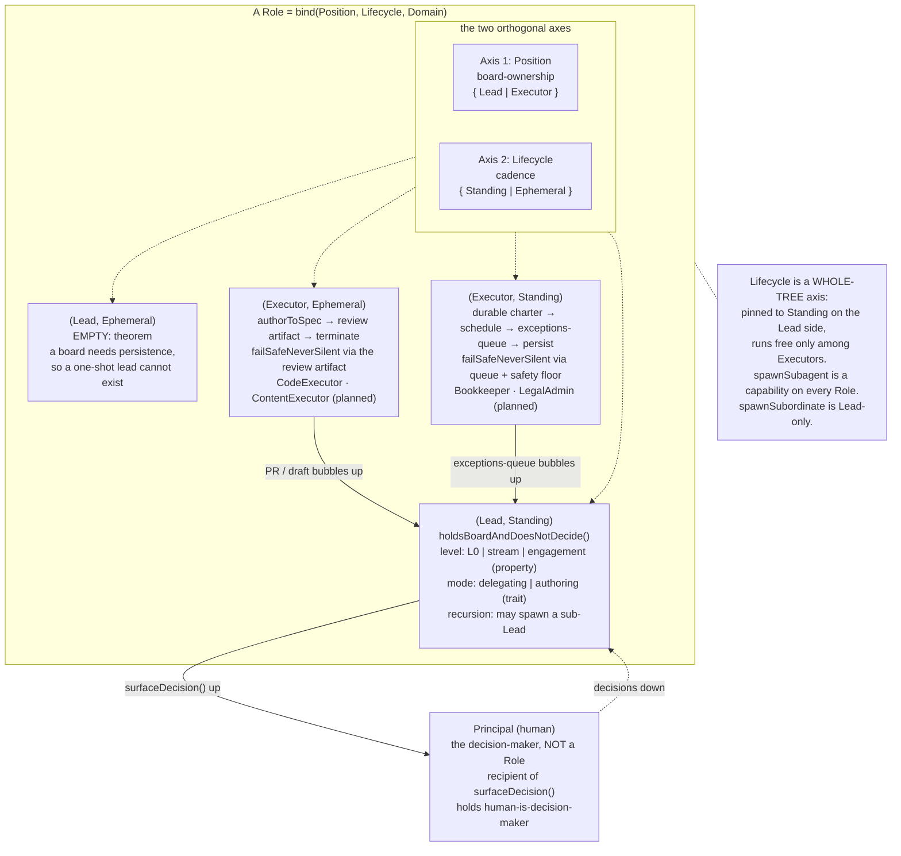

# The agent-role topology

*An accessible overview is in [the README](README.md). This is the full paper.*

## TL;DR

The agent-role paradigm has a type system, and it is built from two independent axes, not one inheritance chain. A role is placed by **position** (does it hold a board and delegate, or author a work product?) and **lifecycle** (is it standing, with a durable charter and a schedule, or ephemeral, opening a review artifact and terminating?). A concrete role binds three things: a position, a lifecycle, and a domain. The two axes form a 2x2 grid with one cell provably empty: **Lead x Ephemeral** cannot exist, because holding a board needs persistence, so a one-shot lead is a contradiction. Lifecycle is therefore a whole-tree axis, pinned to Standing on the Lead side and free only among Executors. Above the grid sits the **Principal**: the human decision-maker, the typed root every Lead reports to, the recipient of every surfaced decision. The Principal is not a Role; it is the authority Roles answer to. The only true classes are the concrete domain bindings: `CodeExecutor` and the planned `ContentExecutor` (Executor, Ephemeral), `Bookkeeper` and the planned `LegalAdmin` (Executor, Standing). Position, lifecycle, level, and mode are axes or properties, never subclasses; the bias is to prefer a property or trait to a subclass unless the interface genuinely varies. This is the type system icm-kit's role layer (a forthcoming SPEC extension) instantiates with `init` and validates with `audit`, and the paper is careful about which checks a file linter can perform statically and which are runtime obligations it cannot.

## Why a topology

The agent-role convention names two roles and lets the rest follow from scope. That is the right altitude for a manual a human reads, and the wrong one for a tool that has to *check* the structure. A linter cannot validate "one recursive lead plus leaf executors" until it knows exactly what a role *is*: which members every role must have, which distinctions are real axes, which apparent kinds are just an axis set to another value, and where a shared obligation lives so it is inherited rather than restated. Those are type-system questions, and this paper answers them.

This is the discipline *Context as Architecture* applied to folders. That paper took "put things where they belong" and resolved it into two axes and a classification function, which is what made the structure machine-checkable. This paper does the same for "one lead plus leaves." Where the first classifies *files*, this one classifies *roles*; both feed icm-kit. The role layer is the file layer's question asked one level up.

The v1 of this paper made one structural mistake, and the correction is the spine of everything below. It modeled roles as a single inheritance chain rooted in an abstract `Role`, splitting first by position and then, *under* the executor branch, by cadence. That made cadence look like an executor-only property. It is not. A Lead is itself a *standing* role (it holds a continuously available board), so lifecycle is a question you can ask of a Lead too, and the answer is forced. A single chain cannot express "this axis applies everywhere but is pinned on one side," because inheritance places a distinction at one depth only. Two orthogonal axes can. So v2 re-roots on two axes, and the empty cell and the pinning fall out as theorems instead of hiding inside a branch.

## The two axes

A role is located by two independent questions. Neither answers the other.

**Axis 1, Position (board-ownership).** Does the role hold a board and delegate, or author a work product?

- **Lead.** Holds the board for its scope, delegates execution downward, reviews and synthesizes what bubbles up, and surfaces decisions to the Principal framed for a fast call. Its defining property is **recursion**: a Lead's subordinates can themselves be Leads, scoped narrower, with the same contract repeating down. Same role, different scope.
- **Executor.** Authors a work product to spec and opens it for review. Holds no board, spawns no subordinate, reviews nothing beneath it. A terminal node with bounded execution autonomy.

The axis is exhaustive and exclusive: a role is one or the other. The discriminant is **board ownership**: holds a board implies Lead, authors a product with no board implies Executor. This is the cleanest line in the topology and the one a checker draws first, because almost every role failure is a role acting as if it were on the other side of it (a lead authoring what it should delegate; a leaf delegating). Authoring is orthogonal to the line: an authoring lead (the thought-partner mode, below) has its hands on the content yet stays a Lead, because it still holds a board. What makes a role an Executor is authoring a product *and* holding no board, not authoring as such.

**Axis 2, Lifecycle (cadence).** Is the role standing or ephemeral?

- **Standing.** Stood up once against a durable charter, then persists. It wakes on a recurring schedule (cron-like or event-driven), runs a standing SOP against state that survives between runs, and sleeps until its next wake rather than terminating.
- **Ephemeral.** Invoked with a per-task spec, authors its product, opens it for review, and terminates. A fresh instance per task, no durable charter beyond the spec, no schedule. Its lifecycle is open, build, review, close, done.

You can ask either axis of any role, so they are independent as *questions*. But their *answers* are constrained by each other, which is the next section. The reframing from v1: neither axis is a subclass chain. v1 treated Standing as a subclass but mode as a trait, applying two bars to two similar distinctions. Here both position and lifecycle are axes, set per role, and the inconsistent bar is gone.

## The grid, and the empty cell

| | **Ephemeral** | **Standing** |
|---|---|---|
| **Lead** | *(empty, by theorem)* | every Lead: L0, stream lead, engagement lead |
| **Executor** | `CodeExecutor`, `ContentExecutor` (planned) | `Bookkeeper`, `LegalAdmin` (planned) |

**The Lead x Ephemeral cell is empty by theorem, not by accident.** A Lead's defining function is to *hold a board*: a continuously available view of its scope that subordinates write to and the Lead reads across many wakes. That requires persistence. An ephemeral role opens for one task and terminates, taking its state with it. A one-shot lead would have to hold a board it cannot persist: the moment it terminated, the board would have no holder and its subordinates would have nothing to report to. No coherent role lives here, and the emptiness is forced by the meaning of "board," not a design choice.

This is why **lifecycle is a whole-tree axis, pinned on the Lead side and free only among Executors.** Lifecycle still *applies* to a Lead as a question, but on the Lead side the answer is fixed to Standing by the theorem. Only among Executors does the axis take two values: an executor that authors one product and terminates (ephemeral) and one that runs a standing SOP on a schedule (standing) are both coherent. This is exactly what v1's single chain could not express: splitting cadence beneath the executor branch silently asserts cadence is an executor-only concern, when it is a tree-wide axis pinned on one side.

A note on recursion, now a property of the Lead position rather than a subclass behavior. A Lead being recursive does not mean it *contains* sub-Leads as a fixed part. It means it *may* spawn a subordinate Lead when its board outgrows one lead, and need not when it does not. The recursion is a capability exercised on demand. An engagement needing no sub-lead has a Lead with no Lead children, and that is well-formed. This is the "do not pre-build empty levels" rule as structure: the tree is grown by spawning, not declared by nesting.

**Reconciling with the Bookkeeper charter.** The charter opens with `Bookkeeper extends LeafExecutor` and calls itself "the standing variant." That OOP shorthand stays valid: "extends LeafExecutor" names the Executor position, "the standing variant" names the Standing lifecycle. The charter describes a grid point in the vocabulary it had; the grid states the same fact on two axes. Map "the standing variant of LeafExecutor" directly onto the (Executor, Standing) cell.

## The Principal: the typed root above the grid

Every Lead surfaces decisions upward. v1 had the method (`surfaceDecision()`) but no typed recipient: the human existed in prose as "the decision-maker" with no place in the type system, so a checker could not name what a decision was surfaced *to*. v2 closes that by typing the human as the root.

**Principal.** The human decision-maker; the typed root, sitting *above* the grid. Critically, the Principal is **not a Role.** It is the authority Roles report *to*, not a node that holds a board or authors a product. It lacks the Role interface (no charter set from a class body, no file-substrate contract, no bounded execution autonomy, because its autonomy is exactly the *unbounded decision authority* every Role lacks). Modeling it as a Role would be a category error: the whole structure exists to feed the Principal, so the Principal cannot be one of the things being fed.

In type terms, the Principal is three things:

- **The recipient of `surfaceDecision()`.** Every Lead's call returns a framed decision *to the Principal*. The decision travels up the Lead chain, getting distilled at each level, until it reaches the Principal as a small set of framed calls.
- **The holder of `human-is-decision-maker`.** v1 correctly made this a base invariant on every Role: every Role's autonomy is bounded execution autonomy, never decision autonomy. The Principal is the *other side* of that invariant: the one place decision autonomy lives.
- **The top of every Lead chain.** Every Lead reports to a parent Lead or, at the top, the Principal directly (L0's parent is the Principal). The chain always terminates at the Principal, never in a cycle and never in an Executor.

So: Executors bubble up to Leads, Leads to parent Leads, the top Lead to the Principal, and decisions flow back down as direction once the Principal calls them. The Principal is the fixed point that makes the recursion bottom out at the top.

## The shared interface every Role implements

Both positions, both lifecycles, and every concrete class share one interface, so a checker can ask any Role instance the same questions. Six members, plus one capability.

**Identity / charter.** A durable declaration of what the role is and is for: its scope, standing constraints, mode. For a Lead, the lead contract plus the scope's `CLAUDE.md`. For an Executor, the class charter (e.g. Bookkeeper's) plus the client root `CLAUDE.md`. This is `identity` content: declarative, durable, "what kind of agent am I in this scope." It is what makes a Role a *class* and not a prompt, since it is set per instance from the same class body.

**Context (fields).** Per-instance state: the situational facts the work runs against. The class names the fields; every value is bound per instance. This is the class/instance seam where reuse lives. The `Bookkeeper` class declares `chartOfAccounts`, `jurisdiction`, `accountantFormat` as *fields*; an instance binds them per business. None live in the class. A Lead's context is its board: the workspace files it reads at its routing level. Same member, different shape.

**Skills (methods).** The operations a role can perform. For an executor these are concrete and enumerable (`intakeTransaction()`, `attributeTransaction()`, `flagException()`); for a Lead they are coordination ops (hold-the-board, delegate, review-and-synthesize, surface-decision, spawn). A declared skill must *resolve*: it must name a capability the instance can actually perform, with any connection it depends on wired. An unresolvable skill is a structural error.

**Contracts (the review substrate).** Every Role exposes its work through a defined *file/substrate* interface, never a live message. The contract differs by lifecycle, which is what makes lifecycle a real axis and not a cosmetic flag. An **ephemeral** executor's contract is the PR (or a draft for sign-off): the artifact plus its description, comments, and review thread. A **standing** executor's is the exceptions-queue plus run log plus periodic package, with only exceptions surfaced. A Lead's is its board (read by its parent Lead, or the Principal at the top) plus the upward channel (a file an L1 writes for its L0). The contract is the typed boundary between a Role and everything above it.

**Files-not-messages.** Every Role coordinates through the shared substrate, never by in-session conversation. This is a structural invariant, not a choice: Roles are separate observable instances that cannot talk in-session. A Lead holds its board by *reading* files; a subordinate bubbles up by *writing* a file the Lead reads. Reporting lines are file read/write relationships. Routing work through the human as a courier violates this; the Principal observes the substrate, it is not a relay.

**Human-is-decision-maker.** Every Role's autonomy is bounded *execution* autonomy, never *decision* autonomy. The structure scales the Principal's judgment by feeding it well-synthesized boards and framed decisions; it does not delegate the judgment. A Lead making a strategic, commercial, relationship, or irreversible call has broken it; so has an Executor deciding an ambiguous tax treatment or creating a new ledger entity. The rule is identical at both positions, which is why it belongs to the shared interface. It is the single most important member, and it is abstract: each class operationalizes *where* its decision boundary sits, but every Role keeps it with the Principal.

**`spawnSubagent` (capability).** Every Role can spawn an ephemeral subagent for its own cognition (research, mapping, review) that returns a synthesis and disappears. This is a capability on every Role, not a class (see the modeling call). It is available equally to a Lead and an Executor. Only `spawnSubordinate` (spawn a leaf or sub-lead) is Lead-only, since only a Lead has subordinates.

Position and lifecycle add structure (a board and `spawnSubordinate` on the Lead side; a work product and a lifecycle-shaped review substrate on the Executor side) without removing any member. A `Bookkeeper` is still answerable to all six; it binds them to an (Executor, Standing) shape.

## The concrete classes

The grid cells are abstract; running agents are instances of concrete classes, each fixing the shared members and axis bindings to a domain. The Lead cell's "classes" are *named bindings of the level property* (L0, stream lead, engagement lead), not subclasses, because they are one role at different scopes. The two Executor cells hold the genuine concrete classes.

**`CodeExecutor` (Executor, Ephemeral).** The development leaf. Spec: a GitHub issue with acceptance criteria. Skills: read the codebase, implement to spec, test, open a PR. Fields: the repo, the branch flow (`feature/* -> develop -> main`), the conventions (test-first, commit conventions, surface-don't-absorb). Contract: the PR (description is what it built and how it verified; comments are status and flags; the diff is the primary artifact). Terminates on merge. The canonical ephemeral executor.

**`ContentExecutor` (Executor, Ephemeral, planned).** The second inhabitant of the ephemeral executor cell. Drafts a content product (document, client write-up, memo) for sign-off rather than code for merge. Spec: a brief plus acceptance criteria. Skills: draft to brief, self-check, surface the draft with open questions flagged. Fields: voice rules, audience, document-type conventions. Contract: the **draft file in its workspace** is the review substrate (the content analogue of the PR diff); the leaf writes it, the lead reviews in place, the Principal gets the decision. Terminates on sign-off. It is promoted from v1's speculative "open slot" for two reasons. First, it is already first-class in the role convention, which names "content a delegating lead should not own" and defines the non-code review substrate as "the draft file and its workspace location." Second, it is the structural reason the Bookkeeper charter needs a *Contract B*: the charter defined a substrate "that replaces the PR" precisely because not every executor authors code, and `ContentExecutor` is the other half of that observation.

**`Bookkeeper` (Executor, Standing).** Keeps a small business's books current and produces the periodic accountant package. Charter: capture, attribute, tax, categorized ledger, accountant package, full stop. Fields: `chartOfAccounts`, `accountingMethod`, `jurisdiction`/`taxRegime`, `accountantFormat`, `attributionTargets`, `booksLocation`, `intakeChannel`, `confidenceThresholds`, `materialityFloor`, and the rest, bound per instance. Skills: `intakeTransaction()`, `extractFields()`, `attributeTransaction()`, `flagException()`, `categorizeTransaction()`, `reconcileAccount()`, `trackTax()`, `closePeriod()`, `generateAccountantPackage()`, `flagAnomaly()`. Contract: the accountant package (Contract A) plus the exceptions-queue + run-log + wake-notification (Contract B, which the charter names as "replaces the PR"). Persists; wakes on the books schedule. The first concrete class to ship.

**`LegalAdmin` (Executor, Standing, planned).** Keeps a small law firm's legal-administrative state current. Where the Bookkeeper is **vertical-agnostic** (books-and-tax fits any small business), `LegalAdmin` is **vertical-specific** (its obligations are particular to legal practice); the library carries both kinds. Charter (sketch): track obligations and renewals (regulatory filings, registrations, trust-account compliance, limitation dates, contract expiries), surface what is coming due, assemble a compliance package, escalate anything consequential. Fields would include the jurisdiction's filing calendar, the firm's registration set, the matter and contract registry, the renewal-lead-time policy. Skills parallel the Bookkeeper's shape: intake a document, extract dates and parties, attribute to an obligation, flag exceptions, assemble a package, never file or sign. Contract: an obligations register plus exceptions-queue plus periodic compliance package. Persists; wakes on a calendar cadence.

**The open room.** Both Executor cells have structural room the current classes do not fill. The (Executor, Standing) cell takes any durable-charter, schedule-woken, exceptions-queue role (inbox-triage, renewals/subscriptions, compliance-watch). The (Executor, Ephemeral) cell takes any per-task, PR-or-draft, terminate-on-review role (a `MigrationExecutor` performing a one-shot migration behind a reviewable artifact, say). New classes are added as new workspaces are in *Context as Architecture*: instantiate the pattern at a new domain. The axis bindings and shared members do not change; only the domain bindings do.

## The modeling calls

A taxonomy can wave at "leads and leaves"; a type system must commit. Each call below is a place the role model leaves room for interpretation, and the topology picks one answer. The bias throughout: **prefer a property or trait to a subclass unless the candidate genuinely varies the interface**, because a subclass is a permanent commitment a checker and generator both carry, whereas a property is cheap to set and a trait cheap to compose. Applied uniformly: position and lifecycle are *axes*, level and mode are *property/trait*, and nothing is a subclass except the concrete domain bindings.

**Position and lifecycle: axes, not a subclass chain.** Each takes values any role can be asked for; a concrete role binds both plus a domain. Neither is a subclass of the other or of a shared `Role` base. v1 made position the first subclass split and lifecycle a second split *under* executors, which is unsound: lifecycle is a tree-wide question, and a chain places a distinction at one depth only. Two axes place it everywhere and record the constraint (the empty cell, the pinning) separately. This also removes v1's inconsistent bar (lifecycle a subclass, mode a trait).

**The Lead invariant is holds-a-board-and-does-not-decide, not authors-nothing.** v1 put `authorsNothing()` on Lead. That is wrong against the model's own **authoring lead / thought-partner** mode, defined for domains where the human is the domain expert and holds the relationship, where the lead "co-authors the work directly with the human, no leaf," and "the one difference is the lead's hands are on the content." An invariant that says a Lead authors nothing makes the authoring lead violate its own supertype. The fix is to identify what actually discriminates a Lead: it **holds a board** and it **does not decide** (surfaces decisions to the Principal, makes only routine coordination calls). Both hold for delegating and authoring leads alike. So the corrected invariant is **`holdsBoardAndDoesNotDecide()`**, and authoring vs delegating is a mode trait, not a violation. The non-decision half is load-bearing: it is what makes a Lead a Lead and not a Principal, in both modes.

**Lead mode (delegating vs authoring): a trait.** Mode does not vary the Lead interface. Both modes hold a board, surface decisions, keep judgment with the Principal, coordinate through files, satisfy `holdsBoardAndDoesNotDecide()`. The single difference is *where the authoring happens*: a delegating lead spawns an Executor and reviews its product; an authoring lead co-authors directly with the human and spawns no leaf. One behavior toggled with the interface unchanged, the textbook profile of a trait. The trait *removes* a capability (spawn-execution-leaf) rather than adding one, and is used "only where the human is the domain expert and holds the relationship," a *policy* condition set per instance, not a structural one. So: trait, set per instance, default delegating. By moving the true invariant to non-decision, authoring stops being an exception and becomes a clean trait value.

**Levels (L0 / L1 / L2): a scope property of Lead, not classes.** This is the central reuse claim, and the type system must honor it. The role model is explicit: a stream lead is "a nested L0, scoped to one stream... Not a new role, the same role at a narrower board," and an engagement lead is the same again, narrower. If these were three classes, "same role at a narrower scope" would be false. So level is a property of Lead taking values along the routing hierarchy (whole-business, stream, engagement), and the names are *named bindings* of that property. This lines the role axis up with the context axis: *Context as Architecture* made L0/L1/L2 a property of the routing axis, not three kinds of file, and the role layer mirrors it. One routing hierarchy, read once for files and once for roles. The top of the property (L0) is the Lead whose parent is the Principal directly.

**Ephemeral subagents: a capability, not a class.** The discriminant for class membership is *observability and review*: the topology is the set of roles the Principal opens, watches, and reviews as separate instances. An ephemeral subagent is the opposite: it is the role's own cognition, spawned in-session, returns a synthesis, disappears, leaves no durable artifact and no review contract. It fails every shared member (no durable charter, no persistent context, no file-substrate contract, not separately observable). So it is a method every Role can call, `spawnSubagent(brief) -> synthesis`. This keeps a sharp line: **persistence and review gate class membership.** Anything that authors a product the Principal reviews, or holds a board, is a class; anything that is just an instance thinking is a capability. The role model already draws this line ("instances still spawn ephemeral subagents freely for their own cognition... the rule is only about authoring work products you would want to watch and review"). Note the subagent is *not* the empty (Lead, Ephemeral) cell: it is not a Lead at all, so it does not sit on the grid.

**`fail-safe-never-silent`: abstract on the Executor position, operationalized per lifecycle.** The rule reads, in the Bookkeeper charter: "act autonomously only on confident, hand-reversible work; route everything uncertain, consequential, or failed to the review pile and notify." It is tempting to read it as a Bookkeeper or standing-executor rule, because that is where it is written down most fully. But the principle is the executor-side form of **human-is-decision-maker**: an executor acts only inside its bounded execution autonomy and routes everything outside it to the Principal. A `CodeExecutor` honors the same principle in its own idiom: it does not silently make a judgment call inside a diff, it surfaces the decision on the PR ("surface-don't-absorb"). So the obligation belongs to the *Executor position*, abstract: every executor must, on any uncertain/consequential/failed unit, escalate rather than act, and never silently drop or decide.

What differs by lifecycle is the operationalization, for a structural reason. An **ephemeral** executor surfaces its *whole* product for review (the diff or draft is the review surface), so "never act silently" is largely satisfied by the review artifact existing. A **standing** executor acts *autonomously on the confident majority* and surfaces only exceptions, so it needs teeth the artifact gives the ephemeral leaf for free: an explicit confidence boundary, a fail-to-review default (route to the queue on any failure, unreadable input, or unset threshold), an *inert-until-configured* stance (the boundary queues everything until thresholds are set, so no instance goes live silently auto-filing), and full traceability in the run log. Putting the obligation only on standing executors would wrongly imply a `CodeExecutor` may absorb decisions silently, which "surface-don't-absorb" forbids. The Executor position is its home.

## The topology

The **Principal** sits above the grid: not a Role, recipient of `surfaceDecision()`, holder of `human-is-decision-maker`, top of every Lead chain. The grid binds two **axes**, Position and Lifecycle, plus a domain. Three cells are inhabited; **(Lead, Ephemeral)** is empty by theorem. The **(Lead, Standing)** cell carries the level property, the mode trait, and the recursion capability; no `L0`/stream/engagement or `DelegatingLead`/`AuthoringLead` boxes appear, because those are property values and trait values, not classes. The two **Executor** cells carry the concrete classes. `failSafeNeverSilent` is the abstract Executor-position obligation, operationalized by the review artifact (ephemeral) and the queue-plus-floor (standing). `spawnSubagent` is a capability on every Role; `spawnSubordinate` is Lead-only.

## The type system this defines, and what it can actually check

This grid is the type system icm-kit's role layer (a forthcoming SPEC extension) instantiates and validates. The bridge between the papers is exact: *Context as Architecture* is the **context layer** (file rules), classifying *files* by routing level, content type, and load pattern and linting them against W1-W7 / F1-F6; this is the **role layer**, classifying *roles* by position, lifecycle, and concrete class and linting them against role rules. Where the context layer runs `classify(file_path, tree, claude_md) -> {routing_level, content_type, load_pattern}`, the role layer runs `classify(role) -> {position, lifecycle, concrete_class}`.

**What `init` instantiates.** Scaffolding a role workspace instantiates a grid binding: it writes the charter (`identity`), stubs the context fields (`context`, values left for the instance), lists the skills (`skills`), and wires the lifecycle-correct contract (PR conventions for an ephemeral executor, the draft-file workspace for a `ContentExecutor`, the exceptions-queue + run-log + package scaffolding for a standing executor). The golden output for a role is the shared interface with its axis and domain bindings filled, which is why a `Bookkeeper` and a `CodeExecutor` workspace come out structurally parallel but lifecycle-shaped differently. Shared members guarantee the parallel; the lifecycle axis guarantees the difference.

**What `audit` can validate statically, and what it cannot.** This is the honest boundary: a file/tree linter reads the workspace, it does not run the agents.

*(a) Statically checkable structure (the linter CAN enforce these), all properties of the files:*

- **A Lead has a board.** A Lead-side role must have its board files present at its routing level. Missing board is a finding.
- **A delegating lead declares a leaf.** A Lead with the delegating trait set must have a `spawnSubordinate` target declared. Delegating with nothing to delegate to is a contradiction.
- **Skills resolve.** Every declared skill must name a capability with its dependency wired (the connection registry, the repo, the intake channel). An undeclared dependency is the role-layer echo of the context layer's `HIDDEN_CONTEXT`.
- **The review substrate is stubbed per lifecycle.** An ephemeral executor must scaffold PR conventions (or the draft-file location for a `ContentExecutor`); a standing executor must scaffold the exceptions-queue + run-log + periodic-package.
- **The position/lifecycle binding is well-formed.** The role must sit in an inhabited cell and bind exactly one value on each axis. A Lead declared ephemeral is malformed by the empty-cell theorem.
- **Charter does not carry operations bloat.** A charter carrying operations content is the role-layer echo of the context layer's `LAYER_BLOAT`.
- **A concrete class has a skills library.** A class missing the `skills` member is a malformed instantiation.

*(b) Runtime-semantic obligations (the linter CANNOT enforce these), properties of what the running agent does:*

- **Did it actually escalate rather than absorb?** The linter can check the exceptions-queue is *present and stubbed inert-until-configured*; it cannot check that last Tuesday the agent routed the ambiguous receipt to review rather than guessing.
- **Confidence thresholds at runtime.** The linter can check `confidenceThresholds` is a declared field and the boundary is inert until set. It cannot check the threshold is *correct* or applied faithfully to a borderline transaction.
- **Whether a surfaced decision was framed well.** The linter can check a Lead has `surfaceDecision()` and an upward channel; it cannot judge whether the framing was a fast, clean call.

So the claim is bounded: `audit` gives a static guarantee that a workspace is a well-formed grid binding, with the right substrate, resolvable skills, and an inhabited cell. It does not certify runtime behavior, which stays enforced by the review substrate (the human reviewing the PR, reading the exceptions-queue) and the inert-until-configured safety floor. Conflating the two would oversell the tool.

**Why the modeling calls matter to the tools.** Because level is a *property*, `audit` validates an L0 and an engagement lead with the *same* Lead rules at different scope values, keeping the rule library small. Because mode is a *trait* and the Lead invariant is *holds-a-board-and-does-not-decide*, the auditor does not flag an authoring lead for having its hands on the content; it checks the non-decision invariant (true in both modes) and the delegating-declares-a-leaf rule only when the delegating trait is set. Because `fail-safe-never-silent` is on the Executor position, `audit` checks the right structural substrate against every executor and the lifecycle-specific operationalization against the right cell, leaving the runtime "did it escalate" question to the review substrate. And because ephemeral subagents are a *capability*, the auditor never looks for a charter or contract on something that is just a role thinking.

## Glossary

Load-bearing terms, alphabetical.

**Authoring lead.** A Lead with the authoring mode trait: it co-authors the product directly with the human and spawns no leaf. Used only where the human is the domain expert and holds the relationship. Still holds a board and does not decide. Contrast delegating lead.

**Board.** A Lead's situational state: the files it reads at its routing level to hold its scope. The Lead's analogue of an executor's context fields. Requires persistence, which empties the (Lead, Ephemeral) cell.

**`Bookkeeper`.** The concrete (Executor, Standing) class for keeping a small business's books and producing the accountant package; exceptions-queue replaces the PR. The first shipped class. Its "extends LeafExecutor, the standing variant" is the (Executor, Standing) binding in OOP shorthand.

**`CodeExecutor`.** The concrete (Executor, Ephemeral) development class: issue in, tested PR out, terminate on merge.

**Concrete class.** A grid binding instantiated as a running agent (`CodeExecutor`, `ContentExecutor`, `Bookkeeper`, `LegalAdmin`), fixing the shared members and axis values to a domain. The only true classes; positions, lifecycles, levels, and modes are not.

**`ContentExecutor`.** A planned (Executor, Ephemeral) class that drafts content for sign-off rather than code for merge; review substrate is the draft file in its workspace. The reason the Bookkeeper charter needs a Contract B.

**Contract (member).** The file/substrate interface a role's work is observed and reviewed through. Shaped by lifecycle: PR or draft file (ephemeral executor); exceptions-queue + run-log + package (standing executor); board + upward channel (Lead). Never a live message.

**Delegating lead.** A Lead with the default delegating mode trait: it spawns an Executor and reviews the product. Contrast authoring lead.

**Ephemeral (lifecycle).** A role invoked per task that opens a review artifact and terminates. Free to vary only among Executors; impossible for a Lead.

**Ephemeral subagent.** An in-session agent a role spawns for its own cognition that returns a synthesis and disappears. A *capability* (`spawnSubagent`) on every Role, not a node, since it has no charter, persistent context, or review contract and is not separately observable. Not the empty (Lead, Ephemeral) cell: it is not a Lead at all.

**Executor (position).** A role that authors one work product, opens it for review, holds no board, spawns no subordinate. Split by lifecycle into ephemeral and standing.

**`fail-safe-never-silent`.** The abstract Executor-position obligation: on any uncertain, consequential, or failed unit, escalate rather than act, never silently drop or decide. The executor-side form of human-is-decision-maker. Operationalized by the review artifact (ephemeral) or the confidence boundary + fail-to-review floor + inert-until-configured + run-log (standing). Whether a run honored it is a runtime fact the linter cannot check.

**Files-not-messages.** The invariant that roles coordinate only through the shared substrate, never in-session, because they are separate observable instances. Reporting lines are file read/write relationships. The Principal observes the substrate; it is not a relay.

**`holdsBoardAndDoesNotDecide`.** The corrected Lead invariant, replacing v1's incorrect `authorsNothing` (which mistyped the authoring lead). Holds in both lead modes.

**Human-is-decision-maker.** The invariant that every Role's autonomy is bounded execution autonomy, never decision autonomy. The Principal is the other side: the one holder of decision authority.

**Lead (position).** A role that holds a board, delegates, reviews, surfaces decisions, and does not decide. Recursive. Always Standing (the empty-cell theorem). Parameterized by a level property and a mode trait.

**Lifecycle (axis).** Cadence; values standing and ephemeral. A whole-tree axis pinned to Standing on the Lead side and free only among Executors.

**`LegalAdmin`.** A planned (Executor, Standing) class for legal-administrative state. Shows the standing cell has more than one inhabitant.

**Level (scope).** A *property* of the Lead position along the routing hierarchy (whole-business, stream, engagement), with named bindings (L0, stream lead, engagement lead). Not subclasses; the same Lead at a narrower board.

**Mode.** A *trait* on the Lead position, delegating (default) or authoring. Toggles one behavior while leaving the interface and `holdsBoardAndDoesNotDecide` unchanged.

**Position (axis).** Board-ownership; values lead and executor. Exhaustive and exclusive; the line a checker draws first.

**Principal.** The human decision-maker; the typed root above the grid, *not* a Role. Recipient of `surfaceDecision()`, holder of `human-is-decision-maker`, top of every Lead chain. Its autonomy is the unbounded decision authority every Role lacks.

**Role.** Any node typed by the grid: a binding of position, lifecycle, and domain. Shares one interface (charter, context, skills, contract, files-not-messages, human-is-decision-maker, plus `spawnSubagent`). The Principal is not a Role.

**`spawnSubagent` / `spawnSubordinate`.** `spawnSubagent` is on every Role (spawn an ephemeral subagent for its own cognition). `spawnSubordinate` is Lead-only (spawn a leaf or sub-lead).

**Standing (lifecycle).** A role with a durable charter that wakes on a schedule, escalates via an exceptions-queue, and persists. The only lifecycle a Lead can have; one of two an Executor can have.

**Trait (mixin).** A composable aspect set per instance that does not vary the interface, used here for lead mode. Contrast a property (level) and an axis (position, lifecycle).

## Adjacent concepts

**Object-oriented type modeling.** The vocabulary, used carefully: abstract interfaces, the Liskov substitution principle (an inhabited cell's class is usable wherever the shared Role interface is expected), and the "favor composition over inheritance" heuristic driving the property-and-trait-over-subclass calls. The departure from textbook single-inheritance is deliberate: a single chain could not express an axis (lifecycle) that cross-cuts the whole tree but is pinned on one side, so the model uses two orthogonal axes plus a grid, with inheritance reserved for the concrete domain bindings. The novelty is the domain and the two-axis re-rooting, not the machinery.

**Context as Architecture (companion paper).** The context layer to this role layer. That paper resolves *file* positioning into two axes and a classification function; this one resolves *role* positioning into two axes and a grid. Levels (L0/L1/L2) appear in both as a property of an axis, not as classes, so the two layers share one encoding of the routing hierarchy.

**ICM (Van Clief and McDermott).** The grandparent methodology, via *Context as Architecture*. ICM's stage contracts (Input, Process, Output, Completion) are the file-layer analogue of a role's contract member: a typed, file-substrate interface between units, reviewed at a defined boundary. A role's contract is a stage contract for an agent rather than a pipeline stage.

**Actor model.** Agents as isolated units that communicate only by message-passing, never by shared mutable state. The role topology shares the isolation (separate observable instances, no in-session talk) but inverts the medium: coordination is through *shared* substrate (files the repo durably holds), not ephemeral messages. "Files, not messages" is a deliberate departure, chosen for observability and durable review.

**Capability-based design.** Modeling ephemeral subagents as a *capability* rather than a node echoes capability-based systems, where what an entity can *do* is granted as a held capability rather than encoded in its type. `spawnSubagent` is a capability every Role holds; `spawnSubordinate` only the Lead position holds. The cell tells you position and lifecycle; the capability set tells you the powers.

**Org design and the unitary executive.** The human-is-decision-maker invariant is an org-design stance: the structure scales one person's judgment, not distributes authority. The Principal is that person typed into the model. The recursion (a Lead whose subordinates are Leads) is a span-of-control device; the difference from a human org is that *no* node holds delegated judgment, only delegated execution. The topology is an org chart whose every box reports decisions, not just status, up to a single Principal.

**Conjecture (open, forward-looking).** Both layers, the context layer and this role layer, reduce to the same two axes: a **scope / position** axis (route a thing so it is present only where relevant) and a **time / lifecycle** axis (schedule a thing so it is present only when relevant). For files the scope axis is the routing hierarchy and the time axis is the load pattern; for roles the scope axis is position-plus-level and the time axis is standing-vs-ephemeral. The conjecture is that this is not coincidence but a consequence of the bounded context window forcing a *space-by-time economy* on everything placed before the model: anything put in front of an LLM competes for finite attention, so the only two levers are *where* (route by scope) and *when* (schedule by time). If right, the two-axis structure should recur in any layer built against a finite context window. Flagged as an open conjecture, not a result; a fuller treatment is left to a future foundational piece.

## References

Liskov, B., and Wing, J. M. (1994). A Behavioral Notion of Subtyping. ACM Transactions on Programming Languages and Systems, 16(6), 1811-1841.

Hewitt, C., Bishop, P., and Steiger, R. (1973). A Universal Modular Actor Formalism for Artificial Intelligence. IJCAI.

Van Clief, J., and McDermott, D. (2026). Interpretable Context Methodology: Folder Structure as Agentic Architecture. arXiv:2603.16021.

usebessemer/research. Context as Architecture. (companion paper, this repository).